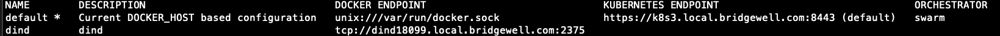

## Develop Flow

1. `git clone <repository url>`
2. Install dependencies, e.g., dotnet restore, pip install, npm install, etc.
3. Set up debug-related environment variables:
    - Staging connection string
    - Spark network communication

## How to switch to another project

- Run the steps above again
- How to ensure environment isolation?
- Dirty development, unexpected execution results

## How to solve it?

- One project, one machine --> Best
- One project, one VM --> Better
- One project, one container --> Balanced situation

## What is a Container

- Best solution for deploying production environments
- Isn't it just Docker?
- Docker Desktop !== Docker

## Containerize

- Lightweight virtualization
- Windows -> WSL 2 (Windows Subsystem for Linux 2)
- Mac -> Linux virtual machine with a shared kernel
- Docker Daemon (aka docker engine or dockerd)

## Containerize

- 

## Deepdive Container

- Based on a base image with the topmost mutable layer at runtime
- [dive: exploring each layer in a docker image](https://github.com/wagoodman/dive)

## Deepdive Container

- 

## Intro to Docker CLI

- `docker ps`
- `docker images`
- `docker network ls`
- `docker context ls`

## docker network ls

## docker context ls

## Why introduce in such detail

- If you don’t know anything, what tools are you using for development?
- How do you solve problems when they arise?
- Is it just asking AI about everything? Do you know how to ask the right questions?

## Develop in Container

- Docker Desktop
- devcontainer → today

## Docker Desktop

- Docker Desktop proposal
- One-Click
  - `https://open.docker.com/dashboard/dev-envs?url=<repoURL>`
  - 302 redirect to `docker-desktop://dashboard/dev-envs?url=<repoURL>`
- Deeplink to launch Docker Desktop
- Git clone to a directory
- `docker compose -f compose-dev.yaml up -d`
- Open with VS Code

## Devcontainer

- Git clone the project
- Open with VS Code & prompt to reopen in devcontainer (VS Code extension)
- Click `Reopen in Container`, then the ready environment to develop
- Supports "port forwarding", "postCreateCommand", "VS Code extension installation"
- [spec](https://containers.dev/implementors/json_reference/)

## Q&A
